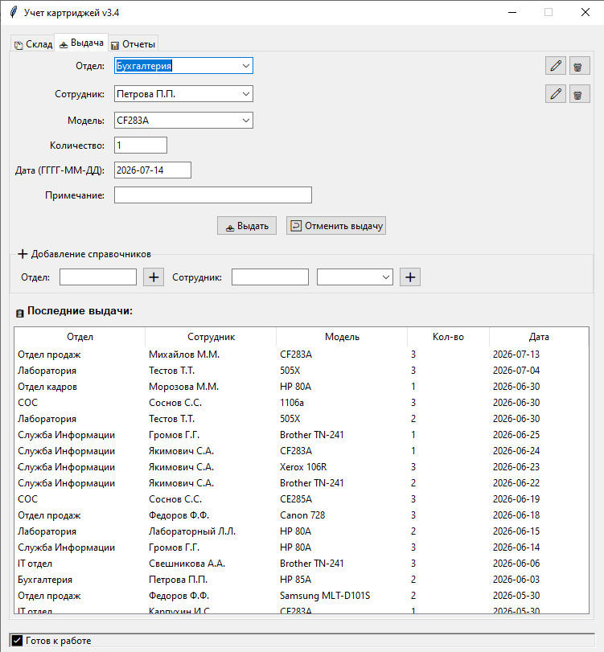
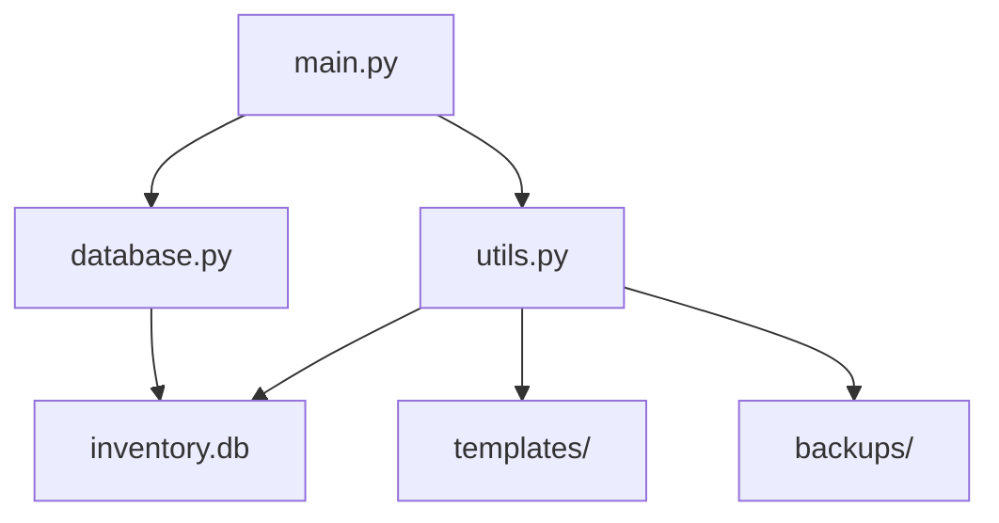

# Учет картриджей

Простая программа для учета картриджей и других материалов. Typical usage - вы один матответсвенный и что то выдаете со склада. Что выдали, то , в основном,  пропало, но может и вернуться не использованным. Перед руководством вам нужен ежемесячный отчет об уходе, плюс поглядывать остатки и рассчитывать закупки. 



Это **локальная программу для учёта картриджей и любых других материалов**:

- **Приход и выдача** — быстро, удобно, с выбором даты задним числом (потому что мы все люди).
- **Остатки считаются автоматически** — никаких формул, никаких `СУММЕСЛИ`.
- **Инвентаризация** — если при пересчёте обнаружился лишний картридж, просто скорректируйте остаток одной кнопкой.
- **Отмена выдачи** — ошиблись? Не беда. Отменили, и остаток восстановился.
- **Отчёты** — за месяц, за год, по остаткам. И **свой шаблон** (ваш Excel-шаблон подставляется автоматически).
- **Бэкап и восстановление** — всё в Excel, человекочитаемо, без страха потерять данные.

---

## 🧠 Технологии

| Компонент | Что используем |
|-----------|----------------|
| **Язык** | Python 3.12+ |
| **Графический интерфейс** | Tkinter (встроенный, без лишних зависимостей) |
| **База данных** | SQLite (лёгкая, локальная, не требует установки) |
| **Работа с Excel** | openpyxl + pandas (читаем, пишем, форматируем) |
| **Сборка в .exe** | PyInstaller (по желанию) |
| **Интерфейс** | Адаптирован под Windows, но легко портируется на Linux/Mac |

---

## Установка
Просто Windows
- Забираем [дистрибутив]( https://github.com/piromanster-beep/inventory/blob/main/dist/InventorySystem.exe "дистрибутив")
- Выкладываем в папку с возможностью записи
- Запускаем


 Windows с  установленным python и желанием править  
Клонируйте репозитарий, в нем.
```bash
pip install -r requirements.txt
python main.py
```

## Использование

- Добавьте отделы, сотрудников, модели.
- Оприходуйте материалы на склад.
- Выдавайте материалы отделам.
- Генерируйте отчеты.
- Боитесь? Можно посмотреть как работает, сгенерировав тестовые данные `python create_test_data.py`

---

## 📄 Описание файлов

| Файл | Назначение |
|------|------------|
| **`main.py`** | Главное окно программы. Вкладки: "Склад", "Выдача", "Отчеты". Все обработчики кнопок и диалоги. |
| **`database.py`** | Все функции для работы с SQLite: `init_db()`, `add_issue()`, `get_stock()`, `add_department()`, `delete_employee()` и др. |
| **`utils.py`** | Генерация отчётов, работа с шаблонами, бэкап и восстановление. |
| **`create_test_data.py`** | Генерация тестового наполнения БД. |
| **`requirements.txt`** | Список библиотек: `pandas`, `openpyxl`, `xlrd`. |
| **`templates/`** | Папка с шаблонами Excel. Программа ищет здесь `spisanie_template.xlsx`. |
| **`backups/`** | Создаётся автоматически при первом бэкапе. Внутри — Excel-файлы со всеми таблицами. |
| **`inventory.db`** | SQLite-база. Создаётся при первом запуске. |
| **`dist/`** | Появляется после сборки `.exe` через PyInstaller. |

---

## 🧠 Связи модулей

